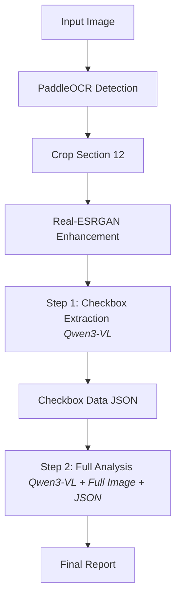

# 🚗 French Constat Analysis with Qwen3-VL + Real-ESRGAN

Automated analysis of French automobile accident reports (Constat Amiable d'Accident Automobile) using a two-step Vision-Language Model (VLM) pipeline with super-resolution enhancement.

## 🎯 Project Overview

This project leverages the power of **Qwen3-VL-8B-Instruct** and **Real-ESRGAN** to provide high-accuracy extraction and interpretation of French accident reports. The system specifically targets the "CIRCONSTANCES" (Section 12) checkboxes, which are often difficult for standard models to read due to low resolution or messy handwriting.

### Key Features
- **Two-Step VLM Pipeline**: Separates checkbox extraction from full document interpretation for maximum precision.
- **Image Enhancement**: Uses Real-ESRGAN to upscale handwriting and checkboxes before analysis.
- **PaddleOCR Integration**: Precision-crops Section 12 for focused VLM processing.
- **Automated Fault Analysis**: Determines liability based on French traffic laws and extracted circumstances.

---

## 🔄 Workflow

The system follows a modular, two-step workflow designed to overcome GPUI memory constraints and maximize VLM accuracy.



### Detailed Steps:
1.  **Step 0: Cropping**: `utils/crop_utils.py` uses PaddleOCR to find Section 12 and saves a crop.
2.  **Step 0.5: Enhancement**: `Real_ESRGAN` upscales the crop to improve small detail recognition.
3.  **Step 1: Extraction**: Qwen3-VL analyzes only the enhanced crop to identify which of the 17 boxes are checked for Vehicle A and B.
4.  **Step 2: Interpretation**: The model combines the full image context with the precise checkbox data to generate a structured analysis.

---

## 🚀 Installation

The project requires a CUDA-capable GPU. The installation is automated via a specialized script.

### 1. Prerequisites
- Python 3.11+
- NVIDIA GPU with CUDA 12.4+
- Hugging Face Token (with access to `Qwen/Qwen3-VL-8B-Instruct`)

### 2. Automatic Setup
Run the installation script to handle PyTorch, Transformers, and Flash Attention 2:
```bash
python install_qwen.py
```

### 3. Environment Configuration
Create a `.env` file in the root directory:
```bash
HF_TOKEN=your_huggingface_token_here
```

---

## 📖 Usage

### Main Workflow
Use `test_qwen_twostep.py` to process an accident report. It automatically handles cropping, enhancement, and the two-step analysis.

```bash
python test_qwen_twostep.py images/your_image.png
```

---

## 📁 Project Structure

### Main Modules
- **`test_qwen_twostep.py`**: The primary entry point orchestrating the entire pipeline.
- **`Real_ESRGAN/`**: Module for image super-resolution. Provides the `inference_images.py` demo used for enhancement.
- **`utils/`**:
    - `crop_utils.py`: Contains logic to detect and crop sections of the Constat.
    - `preprocess.py`: Image handling utilities.
- **`install_qwen.py`**: The current recommended setup script for the environment.

### Legacy Scripts
> [!NOTE]
> Scripts like `app_constat_fewshot.py` and `app_constat_qwen.py` (if present) are part of previous iterations and are kept for reference but are not the primary workflow.

---

## 📊 Outputs

All results are organized in the `output/` directory:

| Path | Content |
|------|---------|
| `output/qwen/{image_name}/analysis.txt` | The final structured interpretation and fault analysis. |
| `output/qwen/{image_name}/checkboxes.txt` | The JSON-like output from Step 1 containing checkbox states. |
| `output/crops/` | Original crops of Section 12. |
| `output/gan/` | Enhanced (upscaled) versions of the crops. |

---

## 🧠 Understanding the Analysis

The final report includes:
1.  **Accident Details**: Date, time, location, injuries.
2.  **Vehicle Profiles**: Driver, vehicle info, insurance, and damage.
3.  **Circumstances Summary**: A human-readable summary of the checked boxes.
4.  **Accident Reconstruction**: A logical flow of events.
5.  **Fault Analysis**: Determination of liability (0/50/100%) based on French rules.

---

## 🛠️ Troubleshooting

- **CUDA Out of Memory**: The script explicitly clears GPU memory between the GAN enhancement and VLM loading to prevent crashes. Ensure no other heavy processes are running.
- **Model Access**: Ensure you have accepted the terms for Qwen3-VL on Hugging Face.
- **Flash Attention**: If `flash-attn` installation fails, the system will automatically fall back to `sdpa` (Standard PyTorch Attention).

---

## 🙏 Acknowledgments
- **Qwen Team** for the Qwen3-VL model.
- **Real-ESRGAN** for the super-resolution module.
- **PaddleOCR** for the robust detection framework.