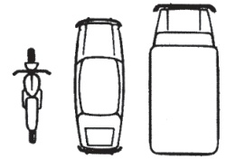
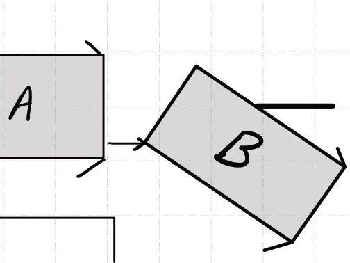
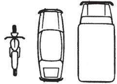

311523 30 0011556 35400

# CONSTAT AMIABLE D'ACCIDENT AUTOMOBILE ACCIDENT REPORT

Date de l'accident

Date of the accident

09/10/2024

## Dégâts matériel à des

véhicules autres que A et B other than vehicles A and B

oui

yes

Heure

Time

12^{th}

14

2 Localisation

Locality

Pays :

Country

France

Property damage

objets autres que des véhicules

damage to other property

oui

yes

no

Lieu :

Rue de la Libéraria

Exact location

42 000 Saint-Etienne

3 Blessé(s) même léger(s)

Injury(es) even if slight

oui

yes

non

✉

5 Témoins : noms, adresses et tél

Witnesses : names, addresses and tel. numbers

Stephanie Godun  Stephgoain@gmail.com

1/2

2/2

065159772

## V ÉHICULE A VEHICLE A

Preneur d'assurance / assuré (voir attestation d'assurance) Detail of insured (see insurance certificate)

NOM : FAURE

Name

Prénom : Aymerick

First name

Adresse

Address

Code postal : 42 000 Pays. France

Portal code

Country

Tél. ou email

. 06 51 83 12 25

Tel. or email

## 7 Véhicule vehicle

## A MOTEUR VEHICLE

Marque, type Make, type

Renault.Clio.3..

## REMORQUE TRAILER

N° d'immatriculation

Registration number

7.22 - FXL - 92

Pays d'immatriculation

Country of registration

France

N° d'immatriculation

Registration number

Pays d'immatriculation

Country of registration

## Société d'assurance (voir attestation d'assurance) (see insurance certificate) Insurance company

NOM : DIRECT ASSURANCE

Name

N° de contrat : 5092052666

Policy N°

F6015092052666

N° de carte verte : N° insurance certificate

Attestation d'assurance ou carte verte valable

Period of insurance validity du from : 18/04/114.au to : 18/10/1125

Agence (ou bureau, ou courtier) : Direct Assurance.

Agency or broker

NOM : Direct Assurance.

Name

Adresse : 48 rue Carnot, 92 138

Address

Pays :

Tél ou email.09.69.32.05.90

Tel or email

Les dégâts matériels au véhicule sont-ils assurés par le contrat?

Is damage to the vehicle insured by the contract?

oui yes ✓ non no ☐

## 9 Conducteur (voir permis de conduire) Driver (see driving licence)

NOM : FAURE

Name

Prénom : AYNERICK

First name

Date de naissance : 1810112000

Date of birth

Adresse : 12 June du Lac

Address

Pays : France

Tél ou email : 06 12 33 30 25

Tel or email

Permis de conduire n° 21AB20112

Driving licence n°

Categorie (A, B...) B

Groups (A, B...)

Permis valable jusqu'au

Driving licence valid until

10 Indiquer le point de choc

initial au véhicule A

par une flèche →

Indicate with an arrow the point

of initial impact →

11 Dégâts apparents au véhicule A : Visible damage to vehicle A

Pare choc Droit

endommage

14 Mes observations : My remarks :

N'avait pas de clignant!

### 12. CIRCONSTANCES Circumstances

Mettre une croix dans chacunes des cases utiles pour préciser le croquis

* Rayer la mention inutile

Put a cross in each of the relevant spaces to help explain the plan

* Strike the unused term

☐ 1 * en stationnement / à l'arrêt*

Parked / stationary

1 ☐

☐ 2 * quittait un stationnement / ouvrait une portière 2 ☐ *Leaving a parking space / opening a door

☐ 3 prenait un stationnement entering a parking space (at the roadside) 3 ☐

☐ 4 sortait d'un parking, d'un lieu privé, 4 ☐

d'un chemin de terre

emerging from a car park, from private grounds,

from track

☐ 5 s'engageait dans un parking, un lieu privé, 5 ☐ un chemin de terre entering a car park, private grounds, a track

☐ 6 s'engageait sur une place à sens giratoire 6 ☐ entering a roundabout or similar traffic system

☐ 7 roulait sur une place à sens giratoire 7 ☐ driving on roundabout etc

heurtait à l'arrière, en roulant dans le même sens et sur une même file Hit the rear end, driving in same direction in a same file (lane)

☐ 9 roulait dans le même sens et 9 sur une file différente going in the same direction but a different lane

☐ 10 changeait de file changing files (lanes) 10 ☐

☐ 11 doublait overtaking 11 ☐

☐ 12 virait à droite turning to the right 12 ✓

☐ 13 virait à gauche turning to the left 13 ☐

☐ 15 empiétait sur une voie réservée à la circulation en sens inverse encroaching upon the lane reserved for opposite traffic

☐ 16 venait de droite (dans une carrefour) 16 ☐ coming from the right on intersection

☐ 17 n'avait pas observé un signal de priorité ou un feu rouge. Failing to stop at sign 17 ☐

indiquer le nombre de cases marquées d'une croix State TOTAL number of spaces marked with a cross

A signer obligatoirement par les deux conducteurs

Ne constitue pas une reconnaissance de responsabilité mais un relevé des identités et des faits servant à l'accélération du règlement

Must be signed by BOTH drivers

Does NOT constitute an admission of liability, but a summary of identities and the facts which will speed up the settlement of claims.

## 13 Croquis de l'accident au moment du choc Sketch of accident 13

Préciser : 1. le tracé des voies - 2. La direction (par des flèches) des véhicules A, B - 3. leur position au moment du choc - 4. les signaux routiers - 5. le nom des rues (ou routes). Indicate : 1. The layout of the road - 2. by arrows the direction of the vehicles A, B - 3. their position at the times of impact - 4. the road signs - 5. names of the streets or roads.

## V ÉHICULE B VEHICLE B

6 Preneur d'assurance / assuré (voir attestation d'assurance)

Detail of insured (see insurance certificate)

NOM : KERVRAN

Name

Prénom : Anne

First name

Adresse

L place de l'abbe Blard

Address

Code postal : 42340

Portal code

Tél. ou email

06 32 32 18 29

Tel. or email

## 7 Véhicule vehicle

## A MOTEUR VEHICLE

Marque, type Make, type

Leugeot. 2

N° d'immatriculation

Registration number

05 - 789 - TK

Pays d'immatriculation

Country of registration

France

REMORQUE TRAILER

N° d'immatriculation

Registration number

Pays d'immatriculation

Country of registration

## 8 Société d'assurance (voir attestation d'assurance) (see insurance certificate) Insurance company

NOM : FLITTER

Name

N° de contrat : 120123975

Policy N°

N° de carte verte : F120123975

N° insurance certificate

Attestation d'assurance ou carte verte valable

Period of insurance validity du from : 29/12/23 au to : 29/12/24

Agence (ou bureau, ou courtier) : FLITTER

Agency or broker

NOM : FLITTER

Name

Adresse : 11 rue Beffroy, 92 200

Address

Pays : France

Country

Tél ou email 01 88 24 H 11

Tel or email

Les dégâts matériels au véhicule sont-ils assurés par le contrat?

Is damage to the vehicle insured by the contract?

## 9 Conducteur (voir permis de conduire) Driver (see driving licence)

NOM : KERVRAN

Name

Prénom : Anne

First name

Date de naissance : 80/04/1945

Date of birth : 2. place de t'abbé Blard

Address : 424.00. Pays : France

Tél ou email : 06.32.32.18.29

Tel or email

Permis de conduire n° 18AB30415

Driving licence n°

Catégorie (A, B...) B

Groups (A, B...)

Permis valable jusqu'au 29/04/2032

Driving licence valid until

Indiquer le point de choc initial au véhicule B par une flèche → Indicate with an arrow the point of initial impact →

11 Dégâts apparents au véhicule B :

Visible damage to vehicle A

Angle arrière droit du pœ-choc

(500 de caisse)

14 Mes observations : My remarks :

Etrait SW son telephone!